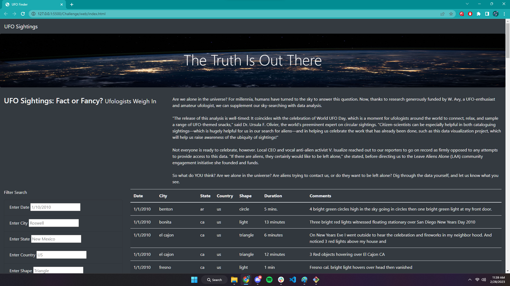
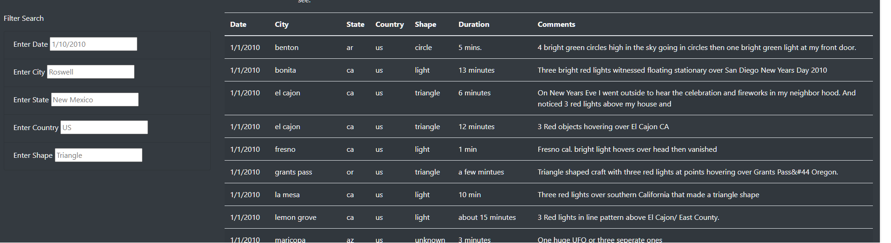
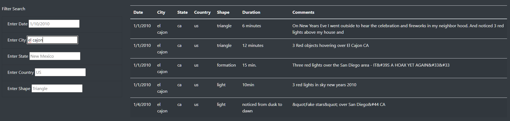

# UFO SIGHTINGS!! BEWARE!

## Overview
This project aims to create a UFO Sighting website that showcases sighting data in a dynamic table.

## Resources
- Data Source: [ufo_sighting_data](Challenge/web/static/js/data.js)
- Software: JavaScript, HTML, CSS

## Website How-To

Link to UFO Sightings Website = http://127.0.0.1:5500/Challenge/web/index.html

Pictured above is how the website looks upon launch.

Data on UFO sightings is formatted in a table with many filters that the user can use to sort the data to suit their needs.

Above is what the data looks like when the filters are in use.

## Summary

### Drawbacks 
I find that while using my website's filter feature, I must know specifically what I am searching for. If I misspell a city, nothing will come up. All cities must be spelled in lower case or nothing will appear in the table. Also, the shape category is very unintuitive unless you know what the exact inputs are for that category.

### Recommendations

1. Make it so the filters are not case-sensitive. This would allow users to find what they are looking for more consistency. 
2. Add an intuitive autocomplete to allow users to easily find what they are looking for.
3. Make the date filter a range rather than just one day. This would allow a user to filter the data by a span of time.

